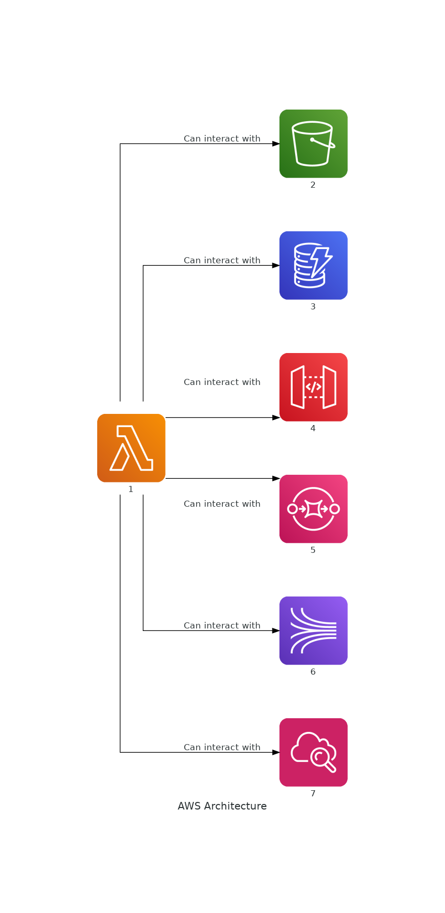
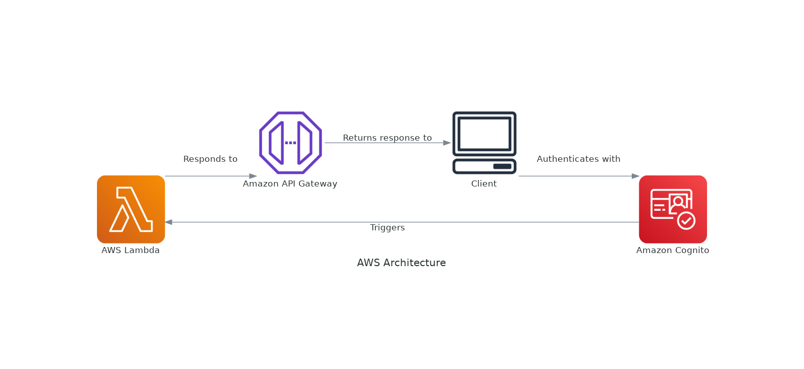
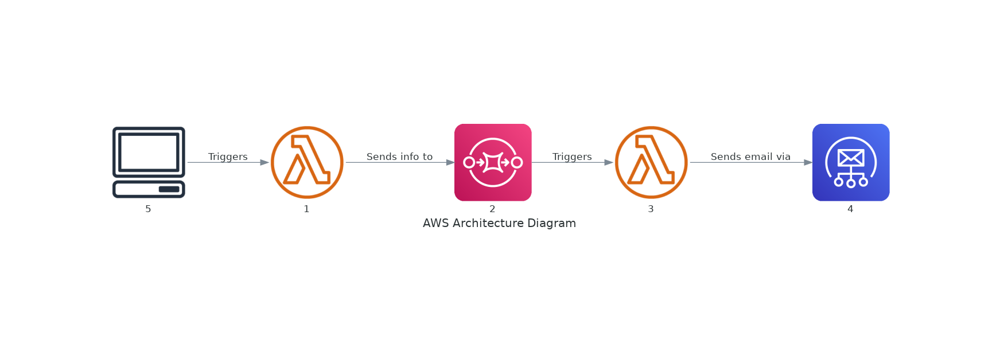

## The Magic of Serverless with Node.js Using Serverless Framework

Ever wished to write code without the hustle of managing servers? Well, if that's the case, welcome aboard the magical carpet of serverless computing! The serverless approach takes us away from server management, offering a fantastic ride through efficient scaling, event-driven execution, and exciting cost savings. Today, we're venturing into the enchanting world of Serverless Framework, using Node.js, our ever-reliable magic wand.

### Serverless Architecture

[](https://mermaid.live/edit#pako:eNqFkD1PwzAQhv-KdXMrBrYMSPkqIDFUTSQGzHDE19aSP1LHLkRV_zsXESTShc16_Tynu_cCnVcEGRwC9kfRFtIJkb9JKI0mFyW8i_VaSHhq263Y0SnRwCFnD6JgKt8-i0eM9Ikjo5Nb_PA7nyINN0bJxgvaD4Vik1wXtXezVc4Wobp7DTrSbFRsVKND66viH7RmtLlfQtN6JRozIxtG6q9IwaERDYWz7uh26tB7N_zOLP5etPzKYQWWgkWtuL3LBEqIR7IMZPxUtMdk-HLproxiir4ZXQdZDIlWkHrFtVUauXe7DGulow-Q7dEMdP0GCbR--A)

Here is a diagram that explains the serverless architecture:

Now, let's explain the diagram:

1. **Client**: This is the user's device, which sends an HTTP request to the API Gateway.

2. **API Gateway**: This is a fully managed service that makes it easy for developers to create, publish, maintain, monitor, and secure APIs. It routes the request to the appropriate Lambda function.

3. **Lambda Function**: This is where your business logic resides. AWS Lambda is a compute service that lets you run code without provisioning or managing servers. It executes your code only when needed and scales automatically.

4. **DynamoDB**: This is a NoSQL database service provided by AWS, which is known for low latencies and scalability. The Lambda function can read data from or write data to DynamoDB.

5. **S3**: This is a storage service provided by AWS. The Lambda function can read data from or write data to an S3 bucket.

6. **External Service**: Sometimes, your Lambda function might need to interact with external services. This could be any third-party service or another AWS service.

<b>Here is a diagram that explains how serverless architecture and serverless frameworks work together:</b>

[](https://mermaid.live/edit#pako:eNqFkUtPwzAMgP9KlPMmDtx6QOpzIIE0rZU4UA6m8baIPEoejGraf8dlHaK7cIvs77Nj-8g7K5AnfOeg37Mmaw1j6UvLcyXRhJa_suWStfy-adZsgx8RPQUpdscyotL1A1tBwAMMhI5uduY3Ngb0V0ZOxiPoNwGsiqYL0prJyicLQdw8OxlwMgoyisGAtkX2D1oSWt_OofF7OSg1IRUh5VdAZ0CxGt2n7PC6qu-t8Zea2d-J5ql0TK3GnlQHnULvWeVA48G699-1FdgrO_jL_D_OOfMEBnZ4yWR8wTU6DVLQLY4j1_KwR03tEnoK3EJUtMfWnAiFGGw9mI4nwUVc8NgLOkIhga6o58FSyGAdT7agPJ6-ASIulkc)

7. **Serverless Framework**: This is a free and open-source web framework written using Node.js. Serverless is the first framework developed for building applications on AWS Lambda, a serverless computing platform provided by Amazon as a part of Amazon Web Services. It deploys and manages the Lambda function and API Gateway.

8. After processing the request, the Lambda function sends a response back to the API Gateway, which then forwards the response to the Client.

This is a simplified view of how a serverless architecture and serverless frameworks work together. In a real-world application, there might be multiple Lambda functions, each serving a specific purpose. There might also be other services involved, such as AWS Cognito for user management, AWS IAM for access control, and more.

<b>Here is a diagram that explains the deployment process of a serverless framework with architecture:</b>

[](https://mermaid.live/edit#pako:eNqFkj1rwzAQhv-KuDmhQzcPBX-mhQ4hNmSoOqjWpTG1JFcfCSbkv_dUO4OhpJu493lPd690gdZIhAQ-rRiOrMm4Zix941DgCXszoOXwztZrxmFvO4-O5cRzoNITy4ir0Z7Q9ugcq6xQeDb2iyyxTTb5Chx6M7rZk5Mn3dcs702QlbFK-M7o2ZFPjtyioKtmRxEd2xe2odpZjPfQktBXoT6kYFXQ7X-dq7jnqIUyRXaP28Q9H2cinYjnptmyHX4HdP42aJSLSd6ZEMNaAmUEyhlAIR9-I70Nc0_cLEQ3GO3wr1uXUgorUEgRd5Je-BJBDv6IioCEjhIPIvQ0HddXQkXwph51C4m3AVcQBkkhFJ2gv6GWxVJ23lhIDqJ3eP0Bs8OuGA)

1. **Developer**: This is you or your team who writes the serverless application code.

2. **Serverless Framework**: This is a free and open-source web framework written using Node.js. Serverless is the first framework developed for building applications on AWS Lambda, a serverless computing platform provided by Amazon as a part of Amazon Web Services. It deploys and manages the serverless application.

3. **AWS CloudFormation**: This is a service that helps you model and set up your Amazon Web Services resources so you can spend less time managing those resources and more time focusing on your applications that run in AWS. The Serverless Framework deploys your application using AWS CloudFormation.

After the deployment, the Developer can send an HTTP request to the API Gateway, which routes the request to the Lambda function. The Lambda function can read data from or write data to DynamoDB and S3. After processing the request, the Lambda function sends a response back to the API Gateway, which then forwards the response to the Developer.

This is a simplified view of the deployment process of a serverless framework with architecture. In a real-world application, there might be multiple Lambda functions, each serving a specific purpose. There might also be other services involved, such as AWS Cognito for user management, AWS IAM for access control, and more.

### Services can interact with Serverless

Here's a brief explanation of the services that can connect to AWS Lambda:

1. **Amazon S3 (Simple Storage Service)**: Lambda can be set up to respond to events in S3 like the creation, deletion, or modification of files (objects) in a bucket.

2. **Amazon DynamoDB**: Lambda can process DynamoDB Streams, which contain all changes to items in the DynamoDB table.

3. **Amazon API Gateway**: API Gateway can route HTTP(S) requests to Lambda functions.

4. **Amazon SQS (Simple Queue Service)**: Lambda can poll for messages on an SQS queue and then process them.

5. **Amazon Kinesis**: Lambda can process Kinesis data streams or Kinesis Firehose data streams.

6. **Amazon CloudWatch**: Lambda can respond to CloudWatch alarms or logs.

Here is the diagram showing how AWS Lambda can interact with other AWS services:



As shown in the diagram:

1. **AWS Lambda** can interact with **Amazon S3**. For example, it can be triggered by changes in an S3 bucket, such as the creation or deletion of files.

2. **AWS Lambda** can interact with **Amazon DynamoDB**. For instance, it can process DynamoDB Streams, which contain all changes to items in a DynamoDB table.

3. **AWS Lambda** can interact with **Amazon API Gateway**. The API Gateway can route HTTP(S) requests to Lambda functions.

4. **AWS Lambda** can interact with **Amazon SQS**. Lambda can poll for messages on an SQS queue and then process them.

5. **AWS Lambda** can interact with **Amazon Kinesis**. Lambda can process Kinesis data streams or Kinesis Firehose data streams.

6. **AWS Lambda** can interact with **Amazon CloudWatch**. Lambda can respond to CloudWatch alarms or logs.

This diagram provides a visual representation of how AWS Lambda can be used in conjunction with other AWS services to build complex and scalable applications.

<b> Here is the diagram showing how AWS Cognito works with AWS Lambda: </b>



As shown in the diagram:

1. A **Client** (for example, a user on a web or mobile application) authenticates with **Amazon Cognito**. Amazon Cognito provides authentication, authorization, and user management for web and mobile apps. Users can sign in directly with a username and password, or through a third party such as Facebook, Amazon, or Google.

2. **Amazon Cognito** can then trigger **AWS Lambda** functions based on certain events, such as user sign-up, user confirmation, or user sign-in. These Lambda functions can be used to add custom logic during the authentication flow.

3. The **AWS Lambda** function can respond to the **Amazon API Gateway**, which is a fully managed service that makes it easy for developers to create, publish, maintain, monitor, and secure APIs at any scale.

4. The **Amazon API Gateway** then returns the response to the **Client**.

This diagram provides a visual representation of how AWS Cognito can be used in conjunction with AWS Lambda to handle user authentication and execute custom logic during the authentication flow.

<b> Here is the diagram showing how AWS Lambda, Amazon SQS, and Amazon SES interact: </b>



As shown in the diagram:

1. A **Client** (for example, a user or an application) triggers the **Lambda: Process Info** function. This could be to process some information and prepare it for sending an email.

2. The **Lambda: Process Info** function sends the processed information to **Amazon SQS**. Amazon SQS is a fully managed message queuing service that enables you to decouple and scale microservices, distributed systems, and serverless applications. SQS is used here as a middleware to queue the information and ensure that it is reliably delivered to the next Lambda function. It also allows for tracking of failures, as messages that cannot be processed are moved to a dead-letter queue.

3. **Amazon SQS** then triggers the **Lambda: Send Email** function. This function is responsible for sending the email.

4. The **Lambda: Send Email** function sends the email via **Amazon SES**. Amazon SES is a cloud-based email sending service designed to help digital marketers and application developers send marketing, notification, and transactional emails.

This diagram provides a visual representation of how AWS Lambda, Amazon SQS, and Amazon SES can be used together to process information, queue it for reliable delivery, and send an email. The use of Amazon SQS as a middleware allows for robust error handling and tracking of failures.

### Getting Your Magic Carpet Ready

Before we embark on this journey, we need to have a few essentials handy:

- An updated installation of Node.js and npm, your trusty companions for this adventure.
- An account with a cloud provider. We will be using AWS as our magic cloud service for this expedition.
- The AWS CLI installed and configured with your secret AWS spell (credentials).

### Step 1: Summoning the Serverless Framework

First things first, let's conjure the Serverless Framework on your system. Here's the magic chant:

```
npm install -g serverless
```

With this incantation, we've invoked the Serverless Framework, an open-source, cloud-agnostic Command Line Interface (CLI). Now we can effortlessly develop and deploy serverless architectures.

### Step 2: Creating a Magical Service

Next, we'll weave a new Serverless service. In the mystical realm of Serverless, a service is an enchanted assembly of functions, events, and resources, all deployed in unison.

Here's the magic phrase to create a new service using an AWS Node.js template:

```
serverless create --template aws-nodejs --path magic-service
```

Abracadabra! We have a new directory named `magic-service`, with two files within its walls: `handler.js` (home to our function code), and `serverless.yml` (the scroll that narrates our service configuration).

### Step 3: Crafting the Magical `serverless.yml` Scroll

The `serverless.yml` scroll defines our service, detailing the provider, functions, events, and resources.

```yml
service: magic-service

provider:
  name: aws
  runtime: nodejs14.x
  stage: dev
  region: us-east-1

functions:
  hello:
    handler: handler.hello
    events:
      - http:
          path: hello
          method: get
```

This scroll narrates the tale of a function named `hello`, handled by the `hello` function exported from our `handler.js` scroll. The magic happens when an HTTP GET request is sent to the `/hello` path.

### Step 4: Penning the Spell in `handler.js`

Let's move on to inscribing our magical function on the `handler.js` scroll. For now, our enchantment will simply echo a "Hello, World!" message to the universe:

```javascript
module.exports.hello = async (event, context) => {
  return {
    statusCode: 200,
    body: JSON.stringify({
      message: "Hello, World!",
    }),
  };
};
```

### Step 5: Unleashing the Magic: Deployment

Finally, it's time to reveal our spell to the world:

```
serverless deploy
```

This incantation wraps and sends our service to AWS, guided by the instructions from our `serverless.yml` scroll.

Once the magic dust settles, the CLI will unveil the information about your service, including the deployed functions and their endpoints. You can test your spell by sending a request to the provided endpoint.

### A Magical Conclusion

Congratulations, sorcerer! You've just ventured into the magical realm of serverless applications using the Serverless Framework and Node.js. Remember, this is just the beginning of the spellbook; the Serverless Framework supports a vast array of enchantments, functions, and resources. It's an incredibly powerful tool for creating, deploying, and managing serverless charms. So, keep your wand ready, and prepare for more magical adventures ahead!
